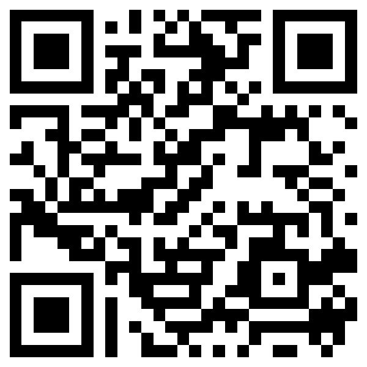

# UAS7 Diary 蕁麻疹日記 — 病友使用說明

這是一份用白話文寫成的簡單介紹，說明這個 app 是什麼、怎麼運作、怎麼安裝到你的手機，以及開始使用最方便的入口。

---

## 1. 這個 app 是做什麼的？

「UAS7 Diary 蕁麻疹日記」是一個幫你每天追蹤蕁麻疹（風疹塊）的日記工具：

- 每天用兩下點選，記錄「風疹塊」和「搔癢」的分數（各 0–3 分）；
- 自動加總成每日分數（0–6 分）和每週分數 UAS7（0–42 分）；
- 用趨勢圖和每週總結，讓你和醫師一眼看出病情變化。

請記得：**這是日記與輔助工具，不是醫療建議**，用藥與治療請依照醫師指示。

## 2. 技術原理（白話版）

### 它是一個「網頁 app」，不是一般 app

這個 app 不需要到 App Store 或 Google Play 商店下載。它本質上是一個網頁，但可以「安裝」到手機桌面，安裝後打開起來就跟一般 app 沒什麼兩樣。

### 需要網路嗎？

- **第一次打開或安裝時**需要連上網路。
- 安裝之後，app 會在你的手機裡留下「離線快取」。之後**沒有網路也能開啟與紀錄**（例如在沒有收訊的地方）。
- 當你連得上網路時，它會自動更新到最新版本。

### 資料存在哪裡？

- 你的所有紀錄**只存在你自己的手機／裝置裡面**（瀏覽器的儲存空間），**不會上傳到任何伺服器**。
- 這個 app **沒有帳號、沒有雲端同步**。也就是說：
  - 換新手機時，舊的紀錄不會自動跟著搬過去；
  - 請**不要**用「無痕／私密視窗」來紀錄，因為無痕模式不會留下資料；
  - 如果清除瀏覽器資料或移除這個 app，紀錄會被刪除。
- 想保留紀錄，最簡單的方式是靠手機本身的備份功能。

### 隱私與安全

- 因為資料只留在你的裝置上、不經過任何伺服器，所以沒有「資料被傳到網路上」的風險，app 也不會收集或回傳你的使用紀錄。
- 提醒建議：為手機設定螢幕鎖定（密碼／指紋），避免旁人直接打開看到你可能不想分享的內容。

### 會啟動 Cookie 嗎？

**不會。這個 app 完全不用 Cookie。**

- 沒有 Cookie、沒有追蹤程式、沒有廣告、也沒有分析工具會去「記住你」或記錄你的瀏覽行為。
- 它記得你的資料，靠的是瀏覽器裡的「本地儲存空間」（localStorage）——可以把這想像成一支**只放在你自己手機裡的小記事本**，跟 Cookie 是兩回事。
- 前面提到的「離線快取」，用的則是瀏覽器的「快取儲存區」，也和 Cookie 無關。

> 小知識：Cookie 通常是網站在「伺服器想認得你、想追蹤你」時才會用到。這個 app **沒有伺服器、沒有帳號、沒有廣告**，所以從頭到尾都不需要 Cookie。

## 3. 如何把網頁安裝成 app（PWA）

### Android（使用 Chrome）

1. 在手機的 **Chrome** 打開以下網址：
   `https://nhchiu.github.io/urticaria-tracking/`
2. 點一下畫面**右上角的三點（⋮）選單**。
3. 點選 **「安裝並建立捷徑」**（部分版本的 Chrome 顯示為「安裝應用程式 / 加到主畫面 / Add to Home screen」）。
4. 點 **「安裝」**。安裝完成後，桌面就會出現 app 的圖示，之後直接點圖示就能打開。

> 小提示：有些版本的手機在第一次打開網頁時，會在下方或上方自動跳出「安裝 App」的提示，直接點安裝也可以。

### iOS（iPhone／iPad，使用 Safari）

1. 在 **Safari** 打開上面的網址。
2. 點一下畫面**下方中央的「分享」按鈕（一個向上箭頭的方形圖示）**。
3. 往下滑，點選 **「加入主畫面」（Add to Home Screen）**。
4. 確認名稱後，點 **「新增」**。桌面就會出現 app 圖示，點進去會以全螢幕方式開啟，用起來更像一般 app。

## 4. 立刻開始使用

用手機相機（或 QR code 掃描功能）直接掃描下面的 QR code，就會連到 app 的網頁：

或直接在瀏覽器輸入網址：

**https://nhchiu.github.io/urticaria-tracking/**

掃完、開啟網頁後，建議接著依照上面第 3 節的步驟，把它安裝到桌面，以後就像一般 app 一樣隨時打開紀錄。

---

有任何問題，歡迎詢問你的醫療團隊。